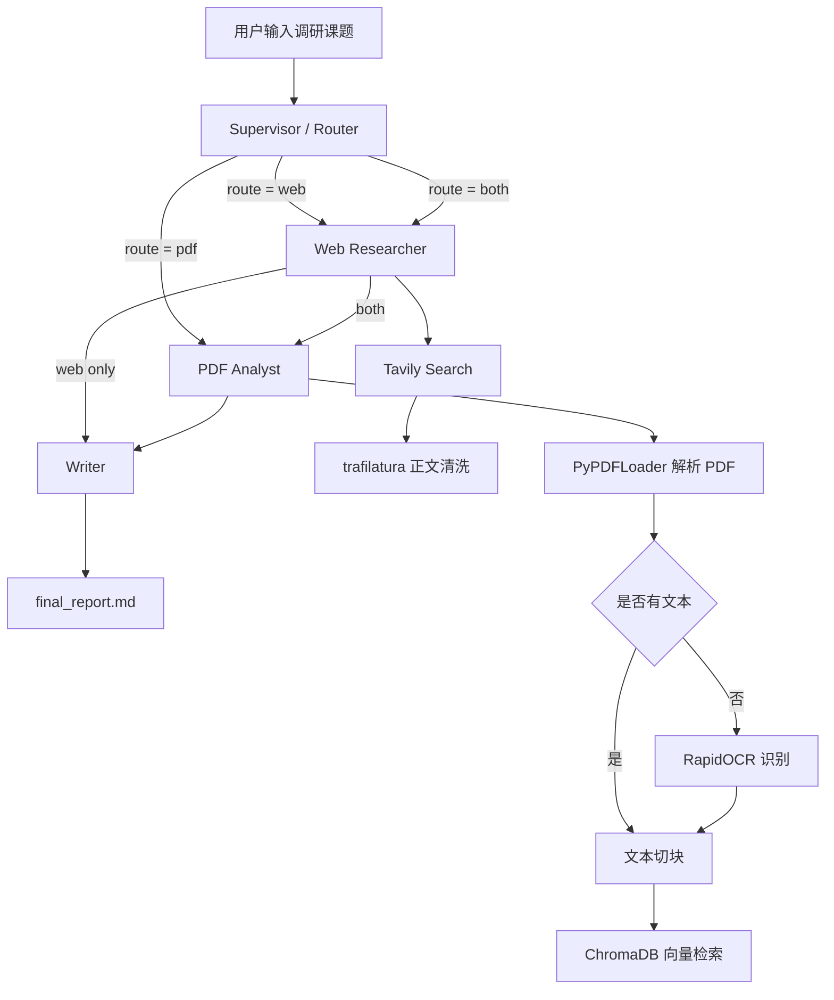

# Research-Team: Agentic RAG 多源行业调研系统

这是一个基于 LangGraph 构建的 Agentic RAG 项目。系统接收用户输入的调研课题后，会根据任务类型自动路由到 Web 检索、本地 PDF 知识库检索或双路检索，再由 Writer Agent 生成结构化 Markdown 调研报告。

## 核心能力

- Multi-Agent 工作流：使用 LangGraph 编排 Router、Web Researcher、PDF Analyst、Writer 四个节点。
- 动态任务路由：Supervisor/Router 根据课题关键词选择 `web`、`pdf` 或 `both` 路径。
- Web 实时检索：集成 Tavily Search 和 trafilatura，获取并清洗网页正文。
- 本地 RAG 检索：使用 ChromaDB 和 BGE 中文 Embedding 构建 PDF 向量知识库。
- PDF/OCR 解析：优先解析文本型 PDF，扫描件 PDF 自动降级到 RapidOCR。
- 报告生成：通过 Prompt 约束报告结构、来源标注和冲突信息分析。
- 异常降级：Web、PDF、LLM 节点均带异常处理，失败时保留可读的中间结果。

## 系统流程



## 目录结构

```text
research-team/
├── data/
│   └── reports/              # 本地 PDF 研报
├── examples/
│   ├── sample_input.txt      # 示例输入课题
│   └── sample_report.md      # 示例生成报告
├── src/
│   ├── agents/
│   │   ├── supervisor.py     # LangGraph 编排和路由逻辑
│   │   ├── researcher.py     # Web 检索 Agent
│   │   ├── analyst.py        # PDF RAG 检索 Agent
│   │   └── writer.py         # 报告生成 Agent
│   ├── tools/
│   │   ├── pdf_parser.py     # PDF/OCR 解析工具
│   │   └── web_scraper.py    # 网页正文抽取工具
│   ├── config.py             # API Key 和模型配置
│   ├── main.py               # 任务入口
│   └── schema.py             # AgentState 状态定义
├── run.py                    # 命令行入口
└── final_report.md           # 默认输出报告
```

## 快速开始

### 1. 安装依赖

```bash
pip install langgraph langchain-openai langchain-community langchain-huggingface chromadb tavily-python rapidocr-onnxruntime pymupdf trafilatura python-dotenv
```

### 2. 配置环境变量

在项目根目录创建 `.env`：

```env
OPENAI_API_KEY=your_openai_compatible_api_key
OPENAI_BASE_URL=https://api.openai.com/v1
TAVILY_API_KEY=your_tavily_api_key
```

默认模型在 `src/config.py` 中配置：

```python
LLM_MODEL = "qwen-plus"
EMBEDDING_MODEL = "BAAI/bge-small-zh-v1.5"
```

### 3. 准备本地 PDF

将行业研报或业务文档放入：

```text
data/reports/
```

首次运行时，系统会自动解析 PDF 并构建 `vector_db/` 向量库。

### 4. 运行

```bash
python run.py
```

运行后输入调研课题，生成结果会写入：

```text
final_report.md
```

## AgentState

系统通过 `AgentState` 在节点之间传递状态：

```python
class AgentState(TypedDict):
    task: str
    route: str
    web_context: str
    pdf_context: str
    report: str
    steps: List[str]
```

其中 `steps` 会累计记录完整执行路径，便于调试和展示。

## 路由策略

Router 会根据课题关键词选择路径：

- `web`：偏实时、新闻、政策、最新动态的问题。
- `pdf`：偏本地研报、PDF、知识库、历史资料的问题。
- `both`：默认路径，同时使用 Web 和 PDF 上下文。

示例：

```text
2025 年我国低空经济发展面临的主要挑战
```

该问题包含年份和行业分析需求，通常会走 `both` 路径。

## 简历项目描述

基于 LangGraph、LangChain、ChromaDB 和大语言模型构建 Agentic RAG 多源行业调研系统，支持 Web 实时检索、本地 PDF 知识库检索、扫描件 OCR 解析和结构化报告生成。系统通过 Router Agent 动态选择检索路径，并将多源上下文注入 Writer Agent，自动生成带来源标注的 Markdown 行业调研报告。

## 后续优化方向

- 增加 Reranker，提高 PDF 检索结果相关性。
- 增加 Critic Agent，对报告引用和事实一致性进行二次校验。
- 增加评估集，统计 recall@k、引用准确率和报告生成质量。
- 将 Web 和 PDF 检索改为并行分支，进一步缩短响应时间。
