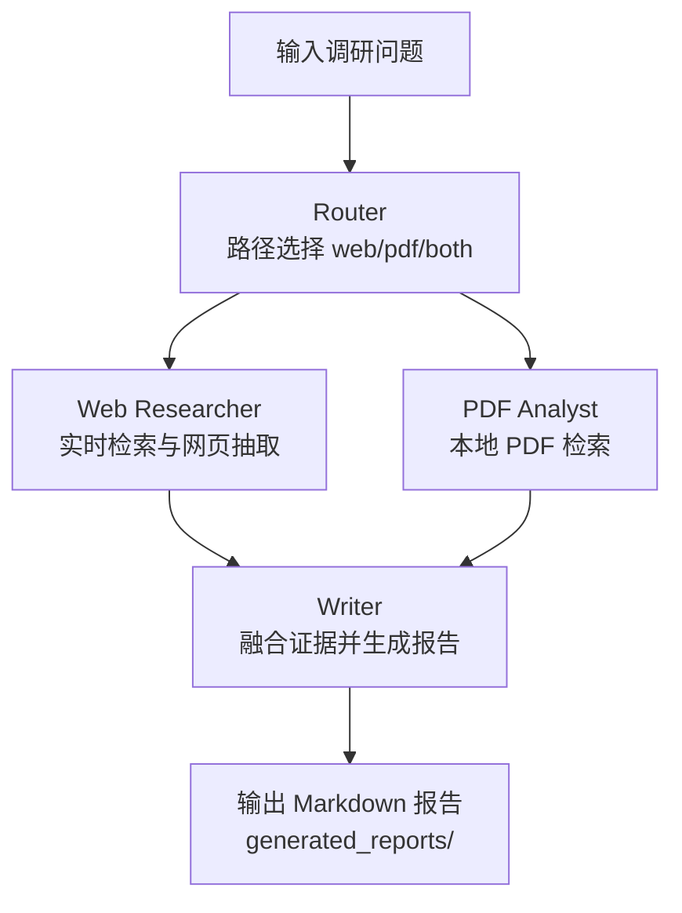

# Research-Term：多源行业调研智能体（Agentic RAG）

`Research-Term` 是一个基于 LangGraph 的多智能体调研系统。输入一个行业问题后，系统会自动路由并组合：
- Web 实时检索
- 本地 PDF 知识检索
- 结构化报告生成

最终输出一份带来源标注的 Markdown 调研报告。

## 项目亮点

- 多智能体协作：Router / Web Researcher / PDF Analyst / Writer 分工清晰
- 动态路由：按问题语义选择 `web`、`pdf` 或 `both`
- 双源证据融合：同时整合网页信息与本地 PDF 证据
- 本地知识检索：基于 Chroma + Embedding 的向量化检索
- 可追溯报告：关键结论可标注来源（Web/PDF）
- 运行体验优化：已移除 OCR 与 OCR 缓存，降低依赖与等待时间

## 技术框架

- 工作流编排：LangGraph
- LLM 调用：LangChain + `langchain-openai`
- Web 搜索：Tavily
- 网页正文抽取：Trafilatura
- 本地文档解析：PyMuPDF（通过 LangChain PDF Loader）
- 向量数据库：ChromaDB
- 向量模型：`BAAI/bge-small-zh-v1.5`

## 系统流程



## 目录结构

```text
research-term/
├── examples/
│   ├── sample_input.txt
│   ├── sample_report.md
│   ├── test_topics.md
│   └── test_reports/             # 示例 PDF（默认本地知识库）
├── src/
│   ├── agents/
│   │   ├── supervisor.py         # 路由与图编排
│   │   ├── researcher.py         # Web 检索
│   │   ├── analyst.py            # PDF 向量检索
│   │   └── writer.py             # 报告生成
│   ├── tools/
│   │   ├── pdf_parser.py
│   │   └── web_scraper.py
│   ├── config.py
│   ├── main.py
│   └── schema.py
├── generated_reports/            # 统一输出目录
├── run.py
└── requirements.txt
```

## 快速开始

### 1) 安装依赖

```bash
pip install -r requirements.txt
```

### 2) 配置环境变量

在项目根目录创建 `.env`：

```env
OPENAI_API_KEY=your_openai_compatible_api_key
OPENAI_BASE_URL=https://api.openai.com/v1
TAVILY_API_KEY=your_tavily_api_key
```

### 3) 运行项目

```bash
python run.py
```

输入调研主题后，系统会自动执行路由与检索，并生成报告。

## 输出说明

- 报告统一保存到：`generated_reports/`
- 文件命名格式：`report_YYYYMMDD_HHMMSS_<topic>.md`

## PDF 数据源说明

- 默认本地 PDF 目录：`examples/test_reports`
- 可通过环境变量覆盖：

```powershell
$env:PDF_REPORTS_DIR="examples/test_reports"
python run.py
```

## 路由策略（简述）

- `web`：偏实时、政策、新闻类问题
- `pdf`：偏本地资料、历史研报类问题
- `both`：需要同时参考外部与本地证据（默认最常见）

## 当前版本说明

- 已移除 OCR 与 OCR 缓存功能
- 扫描版/图片版 PDF 不再解析
- 文本型 PDF 检索能力不受影响

## 常见问题

- 只看到 Web 来源、没有 PDF 来源：
  1. 检查 `examples/test_reports` 下是否有可解析文本型 PDF
  2. 检查问题是否包含本地资料语义（如“本地 PDF/研报/资料”）
  3. 检查首次构建向量库时是否报错

- 报告乱码：
  - 确保文件均为 UTF-8 编码，并使用 UTF-8 环境查看/编辑

## License

MIT
